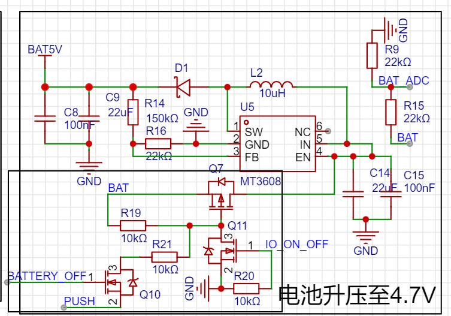

硬件直接在立创 EDA 平台开源 [Hardware: Super Dial 电机旋钮屏](https://oshwhub.com/45coll/a2fff3c71f5d4de2b899c64b152d3da5)

主要硬件列表：
- MCU: ESP32-S3 WROOM-1U-N16R8
- 屏幕: 240x240 圆形 LCD GC9A01 (1.28 寸) + 40.0mm 表蒙子 
- 磁编码器：MT6701CT
- FPC 软天线 IPEX 1代
- 3205 无刷直流电机（无限位）（10 RMB）
- 电源管理
  - MT2492：5V - 3.3V
  - MT3609：电池升压到 5V
  - TP4054 锂电池充电
  - UPS

## 电源管理的基本原理

基本原理：

- PMOS 的开启电压 Vgs = Vg - Vs < 0
- NMOS 的开启电压 Vgs = Vg - Vs > 0
- 栅极（G）、源极(S)、漏极(D)

### 电源管理的实现

ESP32 运行期间，IO_ON_OFF 维持在高电平，Q11 导通；BATTERY_OFF 为低电平，Q10 截止；

PMOS G极被拉低，PMOS 导通，电池正常供电

1. Power OFF

BATTERY_OFF 拉高，电池电压高于 PUSH 的3.3V，Q10 导通，PMOS G 极被拉高，PMOS 截止，电池转 5V 停止工作

初始化 PUSH 引脚复用为 RTC ，在 deep sleep 模式下维持为上拉模式，直接由电池 BAT 供电

测试睡眠状态下：
- BATTERY_OFF 引脚电压为 1.15V 
- PUSH 引脚电压为 0.85V
- PMOS G 极电压等于电池电压（4.01V）

2. Power ON

PUSH 按键按下，电压拉低，Q10 导通，PMOS G 极被拉低，电池恢复供电。同时因为 PUSH 为低电平，ESP32 从 Deep Sleep 模式中被唤醒，重新初始化 IO_ON_OFF 引脚维持在高电平，确保 PMOS 一直处于导通状态。

