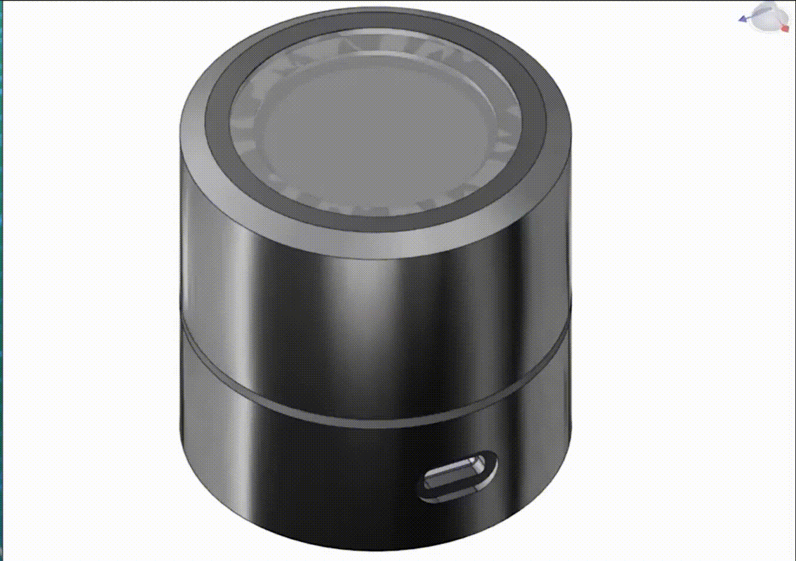

<h1 align="center">X-Knob: A Smart Knob Based on LVGL UI Framework</h1>
<div align="center">


<a href="https://github.com/SmallPond/X-Knob/stargazers"></a>
<a href="https://github.com/SmallPond/X-Knob/network/members"></a>
<a href="https://github.com/SmallPond/X-Knob/pulls"></a>
<a href="https://github.com/SmallPond/X-Knob/issues"></a>
<a href="https://github.com/SmallPond/X-Knob/graphs/contributors"></a>
<a href="https://github.com/SmallPond/X-Knob/blob/master/LICENSE"></a>


  
<!--  -->

<i>喜欢这个项目吗？请考虑给 Star ⭐️ 以帮助改进！</i>


</div>

---

[中文文档](README.md) ｜ [English](README_EN.md)

去年（2021）网上冲浪发现了 [smart_knob(SK)](https://github.com/scottbez1/smartknob)，心动不已。但一番了解后，马上被缺货的“天价”无刷电机劝退😅。最近在刷 B 站时发现 @455555菌 和 虫二大佬（@fywbcchong2）开源的 [Super Dial 电机旋钮屏](https://oshwhub.com/45coll/a2fff3c71f5d4de2b899c64b152d3da5)，这就到我动手玩一玩的时候了🤗。

Super Dial 电机旋钮屏替换了原 smart_knob 的“昂贵电机”且采用了直筒设计，个人觉得更为美观。

另外，smart_knob 的作者在项目中提到未来想使用 lvgl 来设计 UI。
> migrate to LVGL, for better display rendering and easy support for menus, etc. Shouldn't require a full 240x240x24b framebuffer in memory, freeing some for wifi, etc.

巧的是之前我玩过 X-TRACK，UI 极其丝滑。当时基于[稚晖君的 Peak ](https://github.com/peng-zhihui/Peak) 修改了部分硬件在 ESP32 上把玩了一番 [Deck](https://github.com/SmallPond/Deck)。因此，本项目将会是 Smart Knob + X-Track UI 的一个合成版。**故我称为它 X-Knob**。


### Demo video

[演示视频](https://www.bilibili.com/video/BV1N3411Z764/)

[智能家居控制演示视频](https://www.bilibili.com/video/BV1dg4y1H7vv/)

<a href="https://www.bilibili.com/video/BV1N3411Z764/">
    
</a>


### 3D CAD



> 上图（3D 装配图）来自[455555菌的视频](https://www.bilibili.com/video/BV1cG411c7QS/?vd_source=b234f79516f061233222cc1910681264)

主要硬件列表：
- 3 块 PCB：主控板 + 驱动板 + 屏幕板
- MCU: ESP32-S3 WROOM-1U-N16R8
- 屏幕: 240x240 圆形 LCD GC9A01 (1.28 寸) + 40.0mm 表蒙子 
- 磁编码器：MT6701CT
- 3205 无刷直流电机（无限位）（10 RMB）
- 602535 600mAh 锂电池 


X-KNOB 支持的特性：
- [x] X-TRACK UI 框架
- [x] 7 种旋钮模式：边界限制、棘轮、回弹等模式的组合
- [x] 实现基于 LVGL 框架下 smart-knob 的 UI 
- [x] Surface Dial 
- [x] 按键按压振动反馈 
- [x] 电源管理
  - 电池管理、系统深度休眠；
  - V2（最新） 硬件支持 UPS
  - 自动熄屏
- [x] X-Knob 通过 MQTT 接入 Home Assistant，可实现控制接入 HASS 的设备
- [x] 屏幕亮度调节、WiFi 和 MQTT 的 Web 配置
- [x] 支持 OTA 升级

待支持的特性：
- [ ] 基于 ESP32-S3 USB CDC 实现类似 Electron_Bot 的电脑配件模式

# Get Started

基本环境：
- VScode + PlatformIO
- [arduino-esp32](https://github.com/espressif/arduino-esp32) v2.0.5

1. 基本配置
```
git clone https://github.com/SmallPond/X-Knob.git

# 使用 PlatformIO 打开 Firmware 工程
# 重命名 src/secrets.h.example 文件为 src/secrets.h
# 并且修改相关配置：WiFi 密码，MQTT Server 等
cp src/secrets.h.example src/secrets.h

# （Option）修改 config.h 文件的 MQTT_HOST 为你的名字
# 该宏用来附带在 MQTT Topic 中
#define MQTT_HOST               "dingmos"      
```

2. 选择是否使用 MQTT 功能

若暂时不使用 MQTT 功能或没有配置好 WiFi 需要修改 platform.ini 文件来禁用 MQTT 功能

```
-DXK_MQTT=0 
``` 

这种方式将保留 Smart Home(S-Home)的 UI 供玩耍，但不会连接 WiFi 和调用 MQTT 发送消息。

3. 编译 && flash && enjoy 

关于固件下载的**注意事项** ：
- ESP32-S3 支持 USB 下载，可以在不拆开 X-knob 的情况下直接升级固件，参考[#5](https://github.com/SmallPond/X-Knob/issues/5) 
- 直接使用 Release 中的固件，flash 是需要偏移地址 `0x10000`，主要原因是 pio 编译出来的固件只包含 app 部分，而不含 bootloader 等部分。

# 实现记录
## LVGL

基于已有框架增添自己的图片：
- 图片生成C代码网站：[Online Image Converter BMP, JPG or PNG to C array or binary](https://lvgl.io/tools/imageconverter),选择 True color with alpha
- 将生成的C文件保存到`src\App\Resources\Image\`目录下
- 在 `src\App\Resources\ResourcePool.cpp` 增加一行声明
- Icons 素材网站：[iconoir](https://iconoir.com/)
  - Size: 42 x 42
  - Stroke Width: 1.6
  - Color: white

UI 设计工具：
- [NXP GUI Guider](https://www.nxp.com/design/software/development-software/gui-guider:GUI-GUIDER)
  
## SimpleFOC 
- [SimpleFOCStudio](https://github.com/JorgeMaker/SimpleFOCStudio)

## X-TRACK

### 消息通信机制

- `Subscribe/Unsubscribe`：订阅者向发布者发起/取消订阅
- `Publish`: 发布者向订阅者发布消息
  - 当发布者调用此函数时，消息通知框架将会依次调用各个订阅者通过`SetEventCallback()` 函数注册的回调函数。
- `Notify`: 订阅者向发布者主动发送消息
  - 当订阅者调用此函数时，消息通知框架将调用发布者通过`SetEventCallback()`函数注册的回调函数。
- `Pull`: 订阅者主动向发布者拉消息
  - 消息框架将调用发布者注册的回调函数。这种情况下，发布者注册的 callback 是判断`EVENT_SUB_PULL`事件，将信息填充到订阅者指定的 buf 中

个人理解：刚开始接触 X-TRACK 的消息通信框架时，看到 Subscribe 调用，以为这是标准的 Pub/Sub 模型，Pulblish 调用向所有订阅者发布消息，额外的 `Notify` 调用可以指定某个订阅者发送特定消息。但是实际用起来发现跟我想得不一样，Notify 调用是订阅者向发布者发送消息。所以这里的 Pub/Sub 更向是 Server/Client 的架构，Sub 通过 `Subscribe` 调用类似 client 的 `connect` 调用发起连接。不过对 publisher 来说， `publish` 调用省去了 server/client 模式下对 server 对 client 的管理逻辑。 

## 编译问题

问题：`sdkconfig.h no such file or directory`

原因：ESP32-S3 的支持需要 arduino-esp32 版本 >= 2.0.3，在 platformio 中需要对应安装 Espressif 32 >= 4.4.0 以上，我当前使用的是 5.2.0 版本，查看 platformio 安装目录下的文件`.platformio\platforms\espressif32\platform.json`可看到其对应使用 arduino-esp32 2.0.5 版本。

```c
    "framework-arduinoespressif32": {
      "type": "framework",
      "optional": true,
      "owner": "platformio",
      "version": "~3.20005.0"
    },
```

解决方案：`PIO Home -> Platforms -> Updates` 更新版本

# 参考项目

- [Hardware: Super Dial 电机旋钮屏](https://oshwhub.com/45coll/a2fff3c71f5d4de2b899c64b152d3da5)
- [Firmware: Super Dial 电机旋钮屏-gitee](https://gitee.com/coll45/super-dial-motor-knob-screen)
- [smart_knob](https://github.com/scottbez1/smartknob)
- [Super knob](https://gitee.com/wenzhengclub/super_knob)
- [X-TRACK](https://github.com/FASTSHIFT/X-TRACK)
- [Peak](https://github.com/peng-zhihui/Peak)
- [xiaomi_miot_raw](https://github.com/ha0y/xiaomi_miot_raw)
