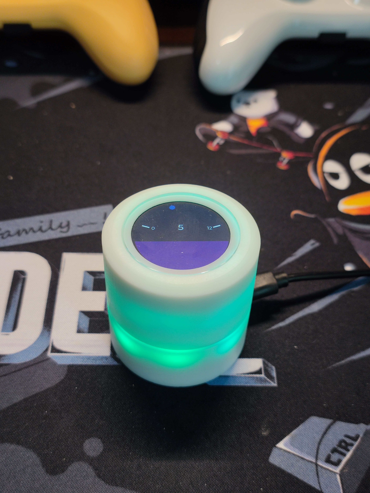
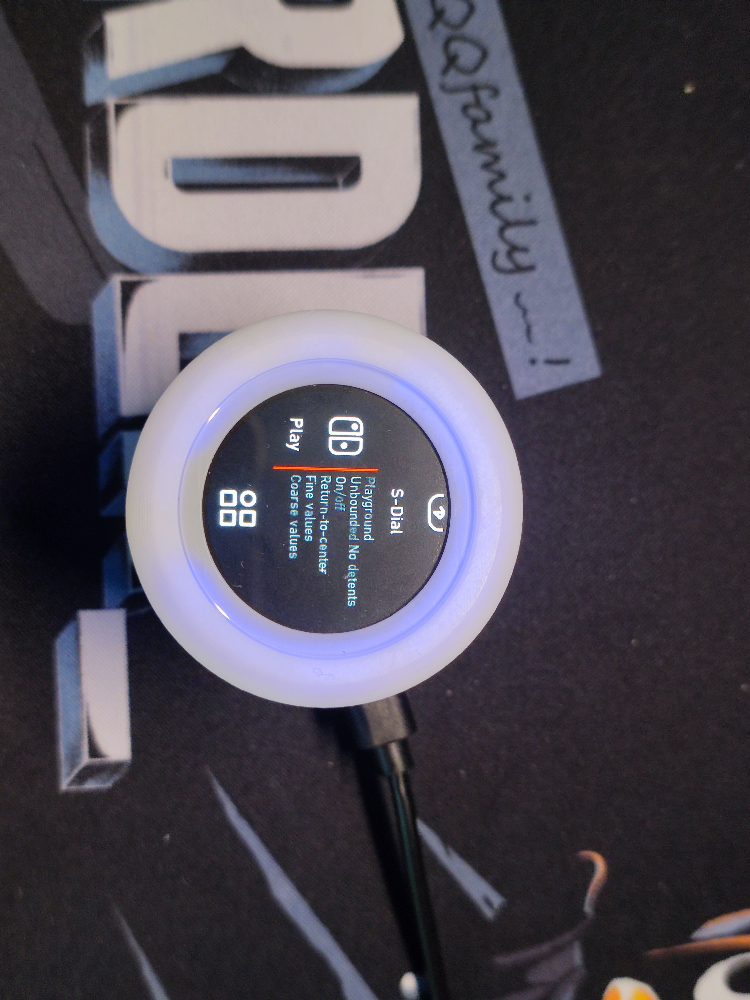

# X-KNOB

去年（2021）网上冲浪发现了[smart_knob](https://github.com/scottbez1/smartknob)，心动不已。但一番了解后，马上被缺货的“天价”无刷电机劝退😅。最近在刷 B 站时发现 @455555菌 和 虫二大佬（@fywbcchong2）开源的[Super Dial 电机旋钮屏](https://oshwhub.com/45coll/a2fff3c71f5d4de2b899c64b152d3da5)，这就到我动手玩一玩的时候了🤗。

- [Super Dial 电机旋钮屏](https://oshwhub.com/45coll/a2fff3c71f5d4de2b899c64b152d3da5)替换了原 [smart_knob](https://github.com/scottbez1/smartknob) 的“昂贵电机”且采用了直筒设计，个人觉得更为美观。
- 另外，[smart_knob](https://github.com/scottbez1/smartknob) 作者在项目中提到未来想使用 lvgl 来设计 UI，之前我也玩过 X-TRACK，深深被其丝滑 UI 吸引。当时基于[稚晖君的Peak](https://github.com/peng-zhihui/Peak) 修改了部分硬件在 ESP32 上把玩了一番[Deck](https://github.com/SmallPond/Deck)。因此，本项目将会是 Smart Knob + Deck(X-Track UI) 的一个合成版。 

### Demo video

[演示视频](https://www.bilibili.com/video/BV1N3411Z764/)

### 3D CAD

> 上图（3D 装配图）来自[455555菌的视频](https://www.bilibili.com/video/BV1cG411c7QS/?vd_source=b234f79516f061233222cc1910681264)

X-KNOB 支持的特性：
- [x] X-TRACK UI 框架
- [x] 7 种旋钮模式：边界限制、棘轮、回弹等模式的组合
- [x] 实现基于 LVGL 框架下 smart-knob 的 UI 
- [x] Surface Dial 
- [ ] 基于 ESP32-S3 USB CDC 实现类似 Electron_Bot 的电脑配件模式

# 实现记录

## LVGL

基于已有框架增添自己的图片：
- 图片生成C代码网站：[Online Image Converter BMP, JPG or PNG to C array or binary](https://lvgl.io/tools/imageconverter),选择 True color with alpha
- 将生成的C文件保存到`src\App\Resources\Image\`目录下
- 在 `src\App\Resources\ResourcePool.cpp` 增加一行声明
- Icons 素材网站：[iconoir](https://iconoir.com/)
  - Size: 42x42
  - Stroke Width: 1.6
  - Color: white

UI 设计工具：
- [NXP GUI Guider](https://www.nxp.com/design/software/development-software/gui-guider:GUI-GUIDER)
  
## SimpleFOC 
- [SimpleFOCStudio](https://github.com/JorgeMaker/SimpleFOCStudio)

## X-TRACK

### 消息通信机制

- `Subscribe/Unsubscribe`：订阅者向发布者发起/取消订阅
- `Publish`: 发布者向订阅者发布消息
  - 当发布者调用此函数时，消息通知框架将会依次调用各个订阅者通过`SetEventCallback()` 函数注册的回调函数。
- `Notify`: 订阅者向发布者主动发送消息
  - 当订阅者调用此函数时，消息通知框架将调用发布者通过`SetEventCallback()`函数注册的回调函数。
- `Pull`: 订阅者主动向发布者拉消息
  - 消息框架将调用发布者注册的回调函数。这种情况下，发布者注册的 callback 是判断`EVENT_SUB_PULL`事件，将信息填充到订阅者指定的 buf 中

个人理解：刚开始接触 X-TRACK 的消息通信框架时，看到 Subscribe 调用，以为这是标准的 Pub/Sub 模型，Pulblish 调用向所有订阅者发布消息，额外的 Notify 调用可以指定某个订阅者发送特定消息。但是实际用起来发现跟我想得不一样，Notify 调用是订阅者向发布者发送消息。所以这里的 Pub/Sub 更向是 Server/Client 的架构，Sub 通过 Subscribe 调用类似 client 的 connect 调用发起连接。不过对 publisher 来说， publish 调用省去了 server/client 模式下对 server 对 client 的管理逻辑。 

## 硬件

结构上可优化的点：
- 屏幕固定不稳，容易晃动，导致屏幕显示和面板对不齐出现黑边：适配件应该开更深的孔？
- 上下结构件互相摩擦，有一些噪音

电路问题：
- 需要去掉 USB 接口到 ESP32-S3 GPIO19 和 GPIO20 的两个电容

# 参考项目

- [Hardware: Super Dial 电机旋钮屏](https://oshwhub.com/45coll/a2fff3c71f5d4de2b899c64b152d3da5)
- [Firmware: Super Dial 电机旋钮屏-gitee](https://gitee.com/coll45/super-dial-motor-knob-screen)
- [smart_knob](https://github.com/scottbez1/smartknob)
- [Super knob](https://gitee.com/wenzhengclub/super_knob)
- [X-TRACK](https://github.com/FASTSHIFT/X-TRACK)
- [Peak](https://github.com/peng-zhihui/Peak)
